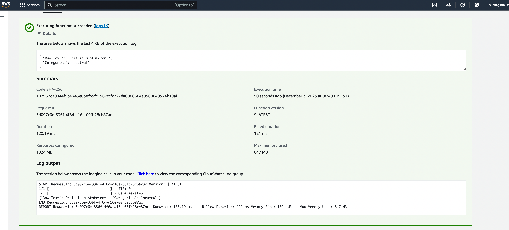
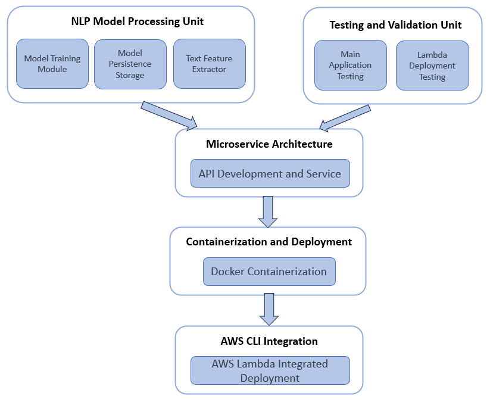

# Final Project 
[](https://github.com/nogibjj/IDS706_FinalProject/actions/workflows/cicd.yml)
# Overview
This project showcases an advanced microservice using a pre-trained Natural Language Processing (NLP) model, deployed via AWS Lambda in a serverless architecture. It specializes in analyzing textual data, categorizing statements into negative, positive, or neutral sentiments. 


# I. NLP Model

## model_training
  ### data source
  
  Pre training dataset is coming from kaggle: https://www.kaggle.com/datasets/ankurzing/sentiment-analysis-for-financial-news/data
  
  ### trainModel.ipynb
  
  This notebook is to anaylyze the data and train a DNN model for categorizing.
  
## saved_model

  This directory has the pre-trained model result with the best performance
  
## 3.vectorizer

  This directory keeps the data preprocessing model based on the dataset we used.

# II.Microservice
## Intro

This service will load the pre trained model to help users categorize the input statement. We utilized fastapi library to achieve this function and logging library to log the info. 


## Test Locally

Type the following command in terminal to startup the service:
```
uvicorn main:app --reload
```


Here we will see the homepage of the service which calls the index() function.


To get a fancy page to see all apis of the service, go to the `http://127.0.0.1:8000/docs`


Then we can click the process text service and click `try it out` to test our categorizing service.


The response should be in json format, something like :

 {"Raw Text": <user input>, "Categories": <netural/positive/negtive>}

# III.Containerization with Distroless Docker Image


## Building the Container Image
To encapsulate our microservice in a Distroless container:
```
docker build -t myapp .
```
This command builds a Docker image named 'myapp' using the Dockerfile in the current directory. The Dockerfile is configured to leverage Distroless images, ensuring that the resulting container is lightweight and secure.

## Running the Microservice in a Container
Once the image is built, it can be run using the following command:

```bash
docker run -p 8080:8080 myapp
```
This command starts a container instance of 'myapp', mapping the container’s port 8080 to the host’s port 8080. This allows the microservice to be accessed via the host machine on port 8080, facilitating easy integration and testing.

# IV.Deploy in AWS Lambda

## 1. Update dockerfile to adapt to Lambda environment


## 2. Upload the image to AWS ECR


Click on the `Create Repository` if you dont have one.

Then go into one repository and upload your microservice image.

Here is some commands to upload.

1.Retrieve an authentication token and authenticate your Docker client to your registry.
Use the AWS CLI:
  ```
   aws ecr get-login-password --region us-east-1 | docker login --username AWS --password-stdin <your repository>
   ```
2.Build your Docker image using the following command
```
docker build -t <appname> .
```
3.After the build is completed, tag your image so you can push the image to this repository:
```
docker tag myfastapp:latest <your repository>/<appname>:latest
```

4.Run the following command to push this image to your newly created AWS repository:

```
docker push <your repository>/<appname>:latest
```

Then we will have our image in ECR for later use.


## 3. Create a lambda function


1. Set permissions


Add neccessary permissions( you may not be allowed to use the service due to some permission limits)


2. Set AWS configure in your terminal

```
aws configure
```

check your account security page to get the security key and set up in your terminal

3. Set `timeout` and `memory`
   
In case some apps take longer time to startup or need larger memory space.


4. A simple test


## 4. Test using AWS CLI
```
aws lambda invoke --function-name myfastapp --cli-binary-format raw-in-base64-out \
--payload '{ "payload": "Hello, Lambda!" }'  output.json 
```

```
cat output.json
```

I got a shell script for lambda test :


## 5. Infrastructure as Code (IaC) Integration

To further streamline our deployment process and ensure consistent, repeatable setups, we integrate Infrastructure as Code (IaC) practices using AWS SAM (Serverless Application Model). AWS SAM is a powerful IaC tool that allows us to define, manage, and deploy our AWS infrastructure in a systematic and predictable manner.

#### Defining the Infrastructure
With AWS SAM, we define our Lambda functions, API Gateway, and other related AWS resources in a SAM template. This template is a YAML configuration file that describes all the AWS resources needed for our project.

```yaml
AWSTemplateFormatVersion: '2010-09-09'
Transform: AWS::Serverless-2016-10-31
Resources:
  MyLambdaFunction:
    Type: AWS::Serverless::Function
    Properties:
      Handler: app.lambda_handler
      Runtime: python3.8
      CodeUri: .
      ...
```
This SAM template outlines the structure and settings of our Lambda function, ensuring that all the cloud resources are provisioned correctly and consistently.

#### Deploying with AWS SAM
Once our SAM template is set up, deploying our infrastructure becomes as simple as running a few commands:

```bash
sam build
sam deploy --guided
```

These commands build and deploy our AWS infrastructure as defined in the SAM template, including our Lambda function and any other required resources.

#### Advantages of Using AWS SAM
- **Consistency:** Ensures that the infrastructure is deployed in a consistent manner, avoiding manual errors.
- **Version Control:** The SAM template can be version-controlled along with the application code, enhancing collaboration and tracking.
- **Automation:** Simplifies and automates the deployment process, making it faster and more reliable.

# V.Load Test

* using python concurrency library to simulate concurrent requests to the AWS Lambda function
  
  

* Result
  
  

  1000 Requests has 938 successful cases and 62 failed cases, success rate 0.938
  
  Total time elapsed: 27.29908561706543 seconds
  
  36.63126355319651 requests per second

  
  
  10000 Requests has 7110 successful cases and 2890 failed cases, success rate 0.711
  
  Total time elapsed: 180.69083070755005 seconds
  
  55.3431513975665 requests per second
  
the service didn't achieve 10000 successful requests per second. I think its due to several reasons:
  
  * The aws concurrency limits.
    
  * python scripts concurrent requests delay: creating 10000 threads to send testing requests costs a lot
    
  * our model takes much time for data processing and prediction. Its kinda not a "microservice"
    
  We may upgrade our service through increasing the concurrency in aws:
  

## VI. CI/CD Pipeline
We have set up a CI/CD pipeline to automate the following tasks:

- Building and testing the application.
- Formatting and linting the code.
- Pretraining the model for deployment.
- Pushing the Docker image to AWS ECR.
- Testing the services deployed in Lambda.

The pipeline is triggered on pushes to the main branch and pull requests to ensure code quality and reliability. It includes the following steps:

1. **Checkout Code**: The pipeline begins by checking out the latest code from the repository.

2. **Install Dependencies**: The `make install` script is executed to install project dependencies.

3. **Linting**: The `make lint` script checks the code for linting issues.

4. **Formatting**: The `make format` script formats the code according to our coding standards.

5. **Testing**: The `make test` script runs tests on the application functions to ensure they work as expected.

6. **Pretraining Model**: The `make trainModel` script pretrains the model for deployment.

7. **Docker Image**: The `make pushDocker` script builds and pushes the Docker image to AWS ECR.

8. **Lambda Testing**: The `make testLambda` script tests the services deployed in AWS Lambda.

These automated steps ensure that our project is continuously integrated, tested, and deployed with reliability and consistency.

# VII. Architectural Diagram
The following diagram provides a comprehensive overview of our project's architecture. It highlights the key components and their interactions, offering a clear visual representation of the system's design. This includes the **NLP Model Processing Unit** , the **Testing and Validation** Unit, the **Microservice Architecture**, and details on **Containerization and Deployment**, and **AWS CLI Integration**. Each element plays a vital role in the functionality and efficiency of our application.
<div style="text-align:center;">
    
</div>

# VIII. Quantitative Assessment

This section provides a quantitative assessment of our system's reliability and stability, utilizing key data science metrics to analyze its performance.

## Load Test Overview
We conducted comprehensive load testing using a Python concurrency library, simulating concurrent requests to our AWS Lambda function. This test aimed to assess the system's response under varying levels of load.

## Test Results and Analysis
1. **1000 Requests Test**
   - Successful Requests: 938
   - Failed Requests: 62
   - Success Rate: 93.8%
   - Total Time Elapsed: 27.30 seconds
   - Requests per Second: 36.63

   This test showed a high success rate, indicating strong system reliability at a moderate load level. The average latency per request was approximately 0.73 seconds.

2. **10000 Requests Test**
   - Successful Requests: 7110
   - Failed Requests: 2890
   - Success Rate: 71.1%
   - Total Time Elapsed: 180.69 seconds
   - Requests per Second: 55.34

   At a higher load, the success rate dropped, suggesting scalability limits under extreme conditions. The average latency per request increased to 1.28 seconds, indicating a performance bottleneck.

## Contributing Factors to Performance
- **AWS Concurrency Limits:** AWS Lambda has inherent concurrency limits which may have contributed to the decreased success rate at higher request volumes.
- **Concurrent Request Delays:** The overhead of creating and managing a large number of threads in the Python script could have affected performance.
- **Model Processing Time:** The time taken for data processing and prediction by our NLP model was significant, impacting the overall response time.

## Proposed Improvements
- **Increasing AWS Concurrency:** Adjusting AWS settings to allow higher concurrency could improve handling of larger request volumes.
- **Optimizing Python Scripts:** Refining our script to manage concurrency more efficiently could enhance performance.
- **Model Optimization:** Streamlining our NLP model for faster processing could reduce response times and increase throughput.

## Conclusion
The quantitative analysis of our system underlines its robustness in handling moderate request volumes efficiently. However, for high-volume scenarios, some adjustments and optimizations are required to maintain performance and reliability.

# IX. Teamwork Reflection
There are two reflection reports under the directory "report".

# X. Video Demo:
Here is the demo vide of this project: https://youtu.be/4UqS68EEPa4

# XI. Some advice:
* Double check your account configure before utilizing lambda apps
* Attention to dockerfile configure(aws lambda has its unique environment) && Test your image before uploading (takes much time)
  Use the following command to test:
  ```
  docker run -p 9000:8080 docker-image:test
  ```
  
  ```
  curl "http://localhost:9000/2015-03-31/functions/function/invocations" -d '{"payload":"hello world!"}'
  ```
  This commands simulate what will happen in the aws lambda app.

  Check this site: https://docs.aws.amazon.com/zh_cn/lambda/latest/dg/images-test.html

  
# Reference :
https://docs.aws.amazon.com/zh_cn/lambda/latest/dg/images-test.html

https://docs.aws.amazon.com/zh_cn/lambda/latest/dg/images-create.html

https://docs.aws.amazon.com/zh_cn/lambda/latest/dg/lambda-invocation.html

https://docs.aws.amazon.com/zh_cn/lambda/latest/dg/invocation-sync.html

https://docs.aws.amazon.com/zh_cn/lambda/latest/dg/invocation-async.html

https://docs.aws.amazon.com/cli/latest/reference/lambda/invoke.html
