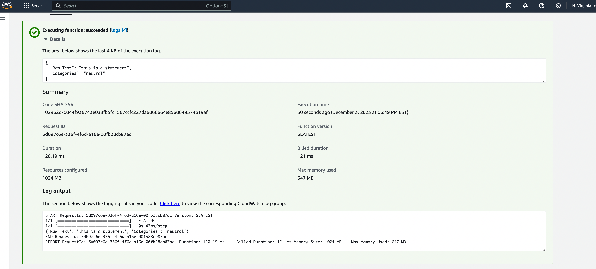

# Final Project 

# Overview
This project demonstrates how to deploy a microservice using pre-trained NLP model to categorize a statement to negtive, positive or neutral categories. This project is deployed through AWS Lambda, a serverless framework.

reference :
https://docs.aws.amazon.com/zh_cn/lambda/latest/dg/images-test.html
https://docs.aws.amazon.com/zh_cn/lambda/latest/dg/images-create.html
https://docs.aws.amazon.com/zh_cn/lambda/latest/dg/lambda-invocation.html
https://docs.aws.amazon.com/zh_cn/lambda/latest/dg/invocation-sync.html
https://docs.aws.amazon.com/zh_cn/lambda/latest/dg/invocation-async.html

https://docs.aws.amazon.com/cli/latest/reference/lambda/invoke.html
